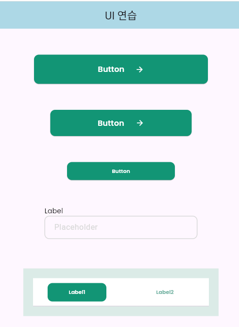
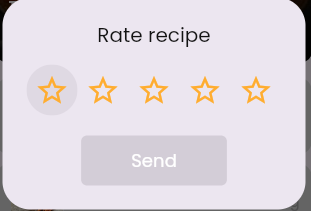
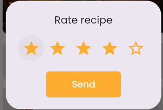
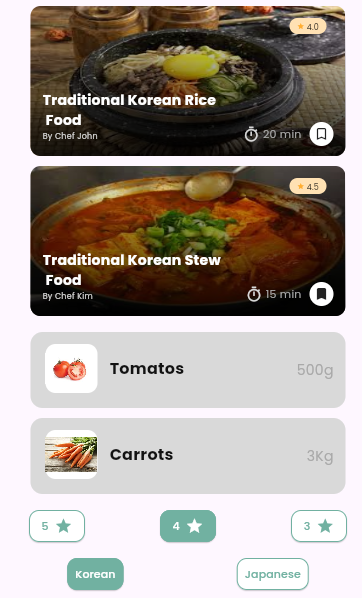

# 🍳 Flutter Recipe App

Flutter로 만드는 레시피 앱

### 1단계 - UI 컴포넌트 연습

- 버튼, 텍스트 필드, 탭 등 기본 위젯 연습
- [Figma 디자인 참고]https://www.figma.com/design/gSeg6yi2QMN0GajM3diTb2/Food-Recipe-App--Community-?node-id=1-3&p=f&t=JaubYXaj4EP0pehl-0

### 결과 화면

### 2단계 - UI 컴포넌트 연습 2

- Container, Stack, StatefulWidget, AlertDialog 등 위젯 연습

### 결과 화면

| AlertDialog Widget   별점 0개          | AlertDialog Widget        별점 4개     | 버튼, 텍스트 필드, 탭 등 기본 위젯 연습                     |
|-------------------------------------|-------------------------------------|----------------------------------------------|
|  |  |  |

### 3단계 - Splash Screen + SavedRecipesScreen 화면 제작

- SplashScreen을 직접제작
- 이전 단계에서 제작한 savedrecipes를 MVVM모델로 재 작성

### 결과 화면

| SplashScreen                                                                                                             | SavedRecipes Screen                                                                                                      | 
|--------------------------------------------------------------------------------------------------------------------------|--------------------------------------------------------------------------------------------------------------------------|
|  |  |

### 4단계 - Search recipes 화면 제작

- Search recipes을 통한 원하는 keyword로 레시피 찾는 기능 구현
- UI 상태 홀더 패턴을 사용

### 결과 화면

| Search recipes 기본화면                                                                           | keyword 입력시                                                                               | 해당 레시피 없을 경우                                                                                  |
|-----------------------------------------------------------------------------------------------|-------------------------------------------------------------------------------------------|-----------------------------------------------------------------------------------------------|
|  |  |  |

### 5단계 - GoRouter와 ShellRouter를 활용해 화면 이동

- SignIn, SignUp 페이지 UI제작
- SignIn 버튼 클릭시 MainScreen으로 이동
- MainScreen은 BottomNavigationBar와 각 탭에 해당되는 스크린들을 ShellRouter로 불러옴

### 결과 화면

| SignIn                                                                                     | SignUp                                                                                     |
|--------------------------------------------------------------------------------------------|--------------------------------------------------------------------------------------------|
|  |  |

| MainHome                                                                                     | SavedRecipes                                                                                |
|----------------------------------------------------------------------------------------------|---------------------------------------------------------------------------------------------|
  |  |